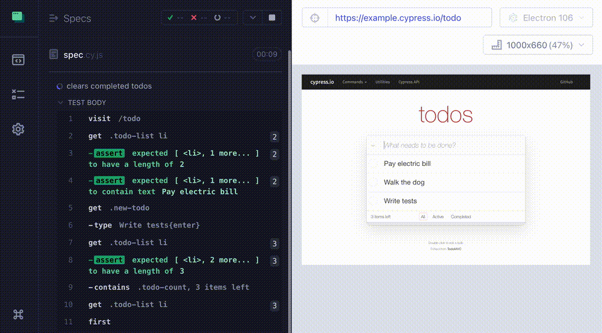
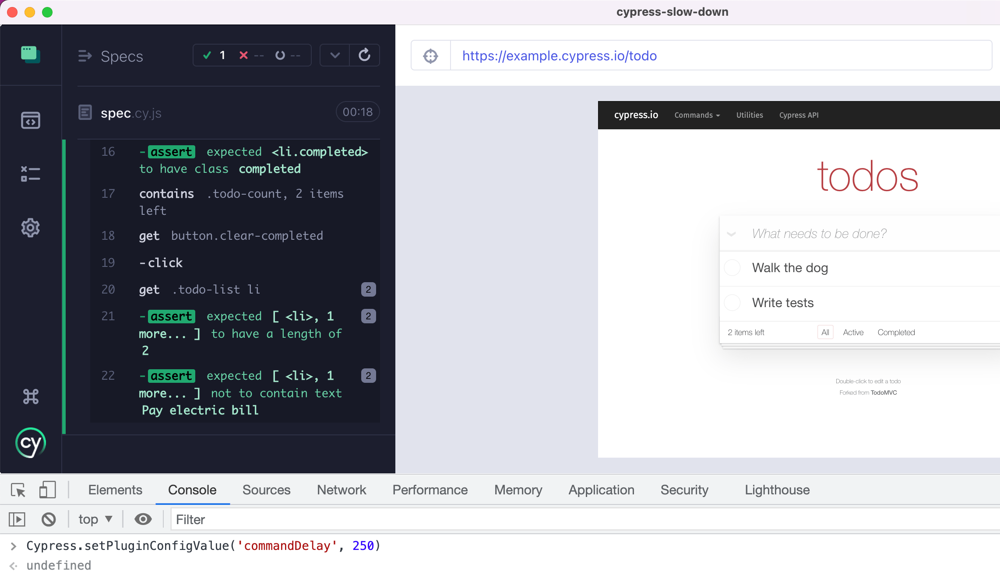

# cypress-slow-down  [](https://github.com/bahmutov/cypress-slow-down/actions/workflows/ci.yml) [](https://dashboard.cypress.io/projects/q3727b/runs)

> Slow down your Cypress tests

Watch the introduction to this plugin in the video [Slow Down Cypress Tests](https://youtu.be/lxx-_nAkQo8). For advanced usage, see the lessons in my [Cypress Plugins course](https://cypress.tips/courses/cypress-plugins).



## Install

Add this NPM package to your project

```text
# install using NPM
$ npm i -D cypress-slow-down
# or install using Yarn
$ yarn add -D cypress-slow-down
```

Include the plugin and call its function from your spec or support file

```js
// cypress/e2e/spec.cy.js
// https://github.com/bahmutov/cypress-slow-down
import { slowCypressDown } from 'cypress-slow-down'
// slow down each command by the default amount
// which is 1 second
slowCypressDown()
```

## Options

You can control the delay before each command (in milliseconds)

```js
// when calling the slowCypressDown function
slowCypressDown(1000)
```

You can also control the delay using the [Cypress environment variable](https://on.cypress.io/environment-variables) `commandDelay`.

```js
// cypress.config.js
const { defineConfig } = require('cypress')

module.exports = defineConfig({
  e2e: {
    env: {
      // https://github.com/bahmutov/cypress-slow-down
      commandDelay: 500,
    },
  },
})
// cypress/e2e/spec.cy.js
import { slowCypressDown } from 'cypress-slow-down'
slowCypressDown() // slows down each command by 500ms
```

You can set the optional `logToConsole` parameter to false to prevent the plugin from logging each delay to the console.

```js
slowCypressDown(1000, false)
```

## Disable the slow down

You can disable the default slowdown by using `false`. For example, from the command line you can pass the boolean value:

```
$ npx cypress run --env commandDelay=false
```

Or you can use the [process (OS) environment variable](https://en.wikipedia.org/wiki/Environment_variable)

```
$ CYPRESS_commandDelay=false npx cypress run
```

Or you can use the `cypress.config.js` to disable the slowdown

```js
// cypress.config.js
const { defineConfig } = require('cypress')

module.exports = defineConfig({
  e2e: {
    env: {
      // https://github.com/bahmutov/cypress-slow-down
      commandDelay: false,
    },
  },
})
```

## Change the command delay from DevTools

Because this plugin uses [cypress-plugin-config](https://github.com/bahmutov/cypress-plugin-config) to read the command delay option, you can change its value or disable the plugin completely from the DevTools console using the command `Cypress.setPluginConfigValue('commandDelay', <value>)`



The re-run the tests by pressing the key "R" or clicking "Run All Tests" button.

## Child commands

You can slow down a part of your test by using the custom dual commands `cy.slowDown(ms)` and `cy.slowDownEnd()`.

```js
// your spec file
// cypress/e2e/spec.cy.js
// https://github.com/bahmutov/cypress-slow-down
import { slowCypressDown } from 'cypress-slow-down'
// registers the cy.slowDown and cy.slowDownEnd commands
import 'cypress-slow-down/commands'
// must enable the plugin using slowCypressDown
// can disable the slow down by default or use some default delay
slowCypressDown(false)

it('runs the middle part slowly', () => {
  cy.visit('/')
  cy.get('...').should('...').slowDown(1000)
  // these commands have 1 second delay
  ...
  cy.slowDownEnd()
  // back to the normal speed
})
```

**Tip:** to see how the commands are slowed down you can use the [cypress-timestamps](https://github.com/bahmutov/cypress-timestamps) plugin.

## Small print

Author: Gleb Bahmutov &lt;gleb.bahmutov@gmail.com&gt; &copy; 2022

- [@bahmutov](https://twitter.com/bahmutov)
- [glebbahmutov.com](https://glebbahmutov.com)
- [blog](https://glebbahmutov.com/blog)
- [videos](https://www.youtube.com/glebbahmutov)
- [presentations](https://slides.com/bahmutov)
- [cypress.tips](https://cypress.tips)
- [Cypress Tips & Tricks Newsletter](https://cypresstips.substack.com/)
- [my Cypress courses](https://cypress.tips/courses)

License: MIT - do anything with the code, but don't blame me if it does not work.

Support: if you find any problems with this module, email / tweet /
[open issue](https://github.com/bahmutov/cypress-slow-down/issues) on Github
